Entrega Backend
1- Estructura de la entrega

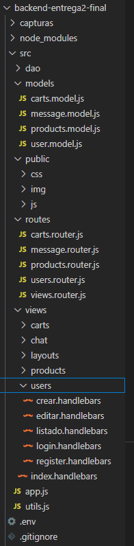

1.1- pagina principal ecommerce
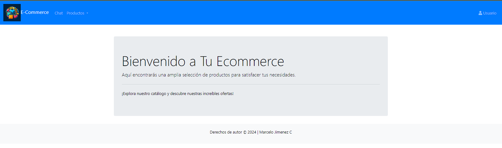

2- se crea login password para la administracion de usuarios 
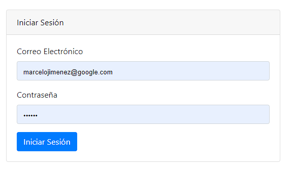

3- Se listan los usuarios creados
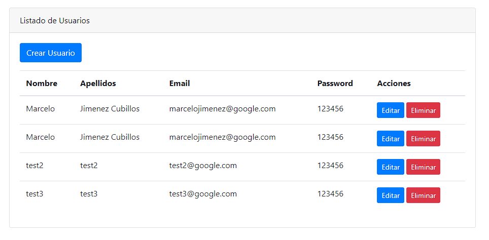

4- Formulario para la creacion de usuarios
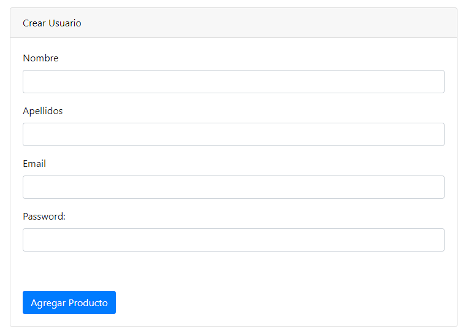

5- Ingreso de usuario al Chat
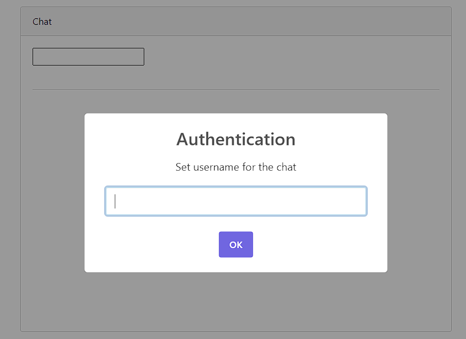

6- Muestra de dialogos del Chat entre los participantes
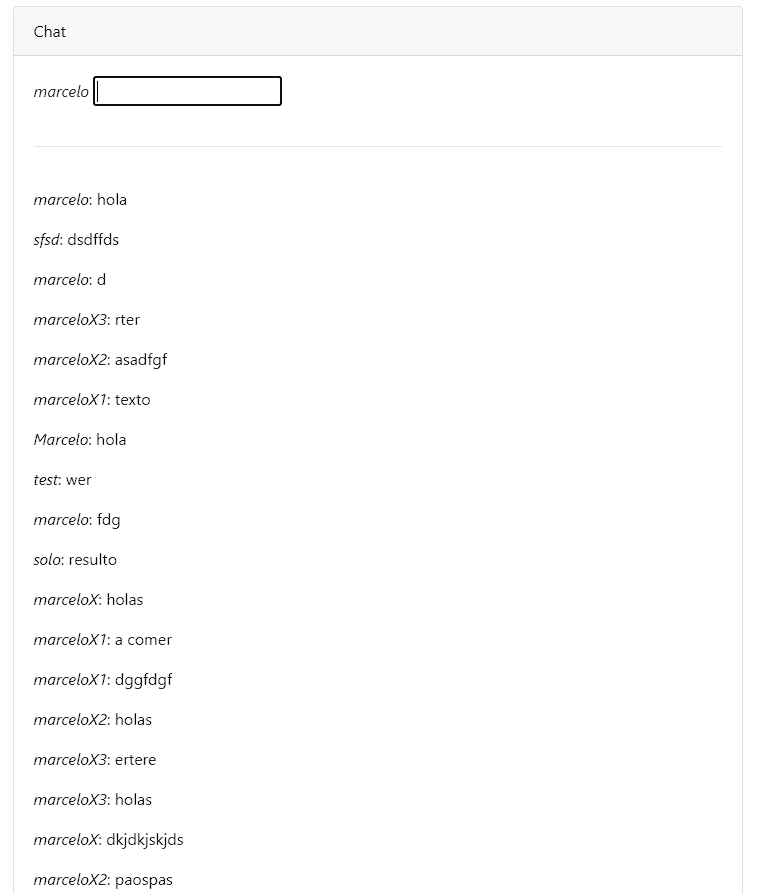

7- Catalogo de compras con paginacion
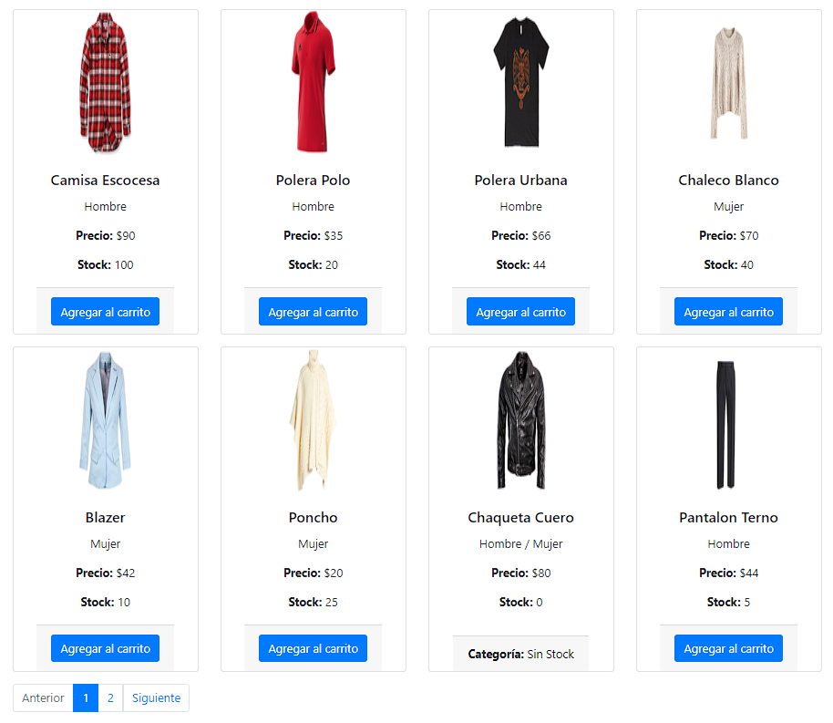

8- Segunda hoja del catalogo de compras
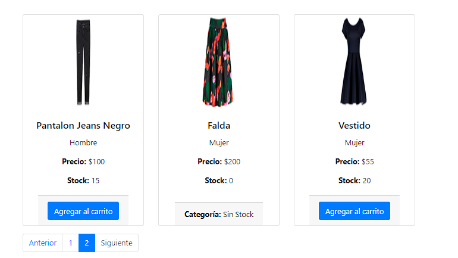

9- Formulario para crear productos al catalogo
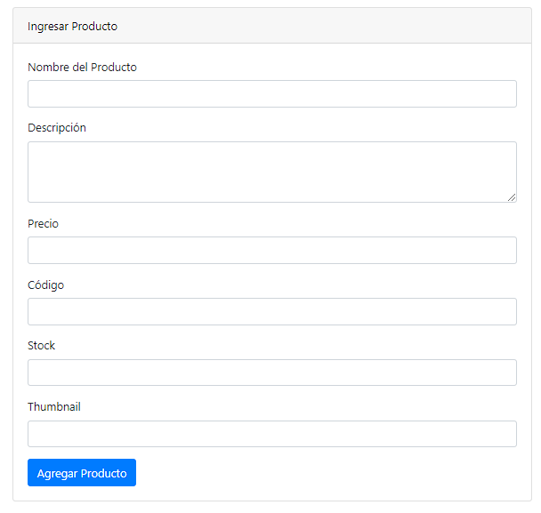

10- Base de datos Ecommerce MongoDB
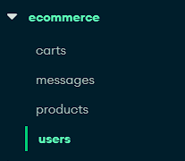